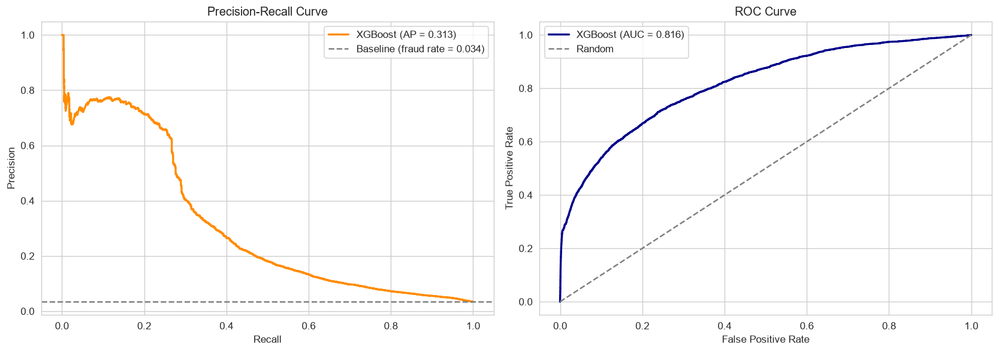
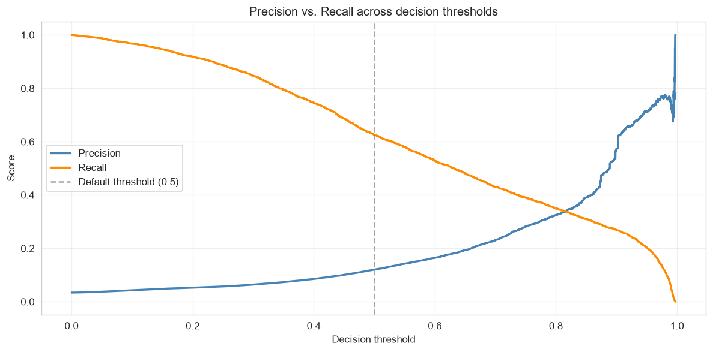
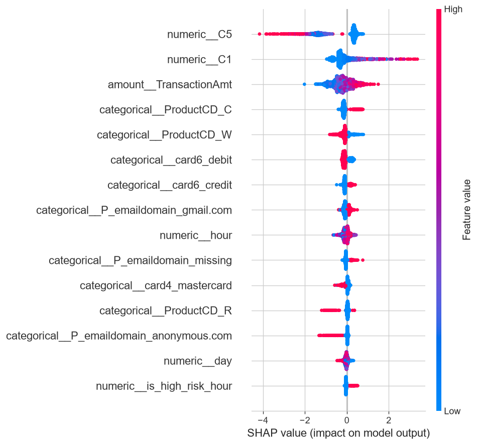

# Fraud Detection — End-to-End ML System

## Business problem
Real-time detection of fraudulent card transactions, minimizing financial
losses while limiting false alarms that degrade the customer experience.

**Why it's hard:**
- Severe class imbalance (~3.5% fraud)
- Asymmetric cost of errors (missed fraud vs. wrongly blocked customer)
- Anonymized features + temporal structure

## Data
IEEE-CIS Fraud Detection (Kaggle) — ~590,000 transactions, target `isFraud`.
`train_transaction` and `train_identity` merged on `TransactionID`.

## Approach
1. **Model** — Gradient boosting (XGBoost) on tabular data
2. **Explainability** — SHAP (per-feature contributions)
3. **Deployment** — FastAPI + Docker on AWS
4. **Interface** — Streamlit dashboard for analyst-facing risk assessment
5. **Monitoring** — Data drift detection

## Model selection

Three model families were compared on the same preprocessing pipeline and the
same chronological split:

| Model | ROC-AUC | PR-AUC | Train time (s) |
|---|---|---|---|
| **XGBoost** | **0.816** | **0.313** | **7.6** |
| Random Forest | 0.773 | 0.139 | 11.4 |
| Logistic Regression | 0.753 | 0.145 | 51.6 |

XGBoost more than doubles the PR-AUC of both alternatives while also being the
fastest to train — the choice is justified on both performance and cost.

## Results

| Metric | Value |
|---|---|
| ROC-AUC | 0.816 |
| PR-AUC | 0.313 |
| Baseline fraud rate | 3.50% |

Accuracy is deliberately not reported: a model predicting "never fraud" would
score 96.5% while catching nothing. PR-AUC is the honest metric under this level
of imbalance — a random classifier would score ~0.035, so the model performs
roughly 9× better than chance.

Validation uses a **chronological split** (earliest 80% for training, latest 20%
for validation) rather than a random one, preventing temporal leakage.



### Threshold selection

The model outputs a probability; the decision threshold sets where to draw the
line between "approve" and "flag". Lowering it catches more fraud (higher recall)
at the cost of more false alarms (lower precision). The right value is a business
decision, driven by the relative cost of a missed fraud versus a manual review.

| Threshold | Recall | Precision | Frauds caught | False alarms |
|---|---|---|---|---|
| 0.3 | 84.7% | 6.4% | 3,442 | 50,119 |
| 0.4 | 74.7% | 8.5% | 3,034 | 32,456 |
| 0.5 | 62.6% | 12.0% | 2,544 | 18,576 |
| 0.6 | 53.0% | 16.5% | 2,153 | 10,916 |
| 0.7 | 43.1% | 23.1% | 1,750 | 5,842 |

In insurance and banking, a missed high-value fraud typically costs far more
than a manual review, so the threshold would usually be set below 0.5 to favour
recall.



### Global explainability

A SHAP summary plot shows which features drive the model overall. The anonymized
counters (C5, C1) dominate, followed by transaction amount, product type, and
the engineered time features.



## Feature engineering: an experiment worth documenting

Testing the dashboard revealed that the model relied almost entirely on three
anonymized counting features (C1, C3, C5) provided by Vesta, the payment
processor behind the dataset. Their exact semantics are undocumented — analysis
showed two of them behave opposite to intuition (non-zero C3 and C5 correlate
with *legitimate* activity, not risk). This raised an explainability concern:
a fraud decision justified by an opaque counter is hard to defend to an analyst
or a regulator.

### Attempt 1 — Replace opaque features with interpretable ones

Engineered four business-level features, computed causally (each transaction
sees only *earlier* transactions from the same card, preventing temporal leakage):

| Feature | Meaning |
|---|---|
| `amount_vs_card_mean` | Ratio of this amount to the card's historical average |
| `time_since_last_txn` | Seconds since this card's previous transaction |
| `card_txn_count` | Number of prior transactions on this card |
| `is_first_transaction` | Flag for cards with no prior history |

These features do carry signal — fraud rate rises from 2.3% (below-average
amounts) to 4.4% (2–5× the card's usual spend). However, adding them produced no
meaningful gain (PR-AUC 0.3132 → 0.3068), and none appeared in the top 20 feature
importances. The likely cause: `card1` groups ~9,800 values across 590k
transactions, so it identifies a *card segment* rather than an individual card —
diluting any individual behavioral signal.

A second, more fundamental problem emerged when running the test suite: these
features require card-level transaction history, which is available during
training (the full dataset is in memory) but **not at inference time**, when the
API receives a single isolated transaction. Serving them in production would
require a feature store maintaining running per-card statistics — significant
infrastructure for features that showed no measurable gain.

### Attempt 2 — Quantify the cost of removing the opaque features

| Variant | ROC-AUC | PR-AUC | Δ PR-AUC |
|---|---|---|---|
| With C counters | 0.816 | 0.313 | — |
| Without C counters | 0.781 | 0.168 | **−0.145** |

Removing them costs roughly **45% of the model's precision-recall performance**.

### Decision

Keep the C counters. A fraud system that misses nearly half the fraud it could
catch is not more deployable for being explainable. The interpretable features
are retained as well — they cost nothing and improve the readability of
individual SHAP explanations.

The dashboard labels these variables neutrally and states explicitly that they
are proprietary indicators from the payment processor. In a real engagement,
their definitions would be obtained from the data owner rather than inferred.

## Live demo
(TODO: API link + dashboard link)

## Tech stack
Python · pandas · scikit-learn · XGBoost · SHAP · MLflow · FastAPI
· Docker · AWS · Streamlit

## Project structure

```text
fraud-detection/
│
├── data/                       # Data (git-ignored)
│   ├── raw/                    # Raw Kaggle CSVs
│   └── processed/              # Cleaned data / features
│
├── notebooks/                  # Exploration and analysis
│   ├── eda.ipynb               # Exploratory data analysis
│   ├── modeling.ipynb          # Model comparison, evaluation, SHAP
│   └── figures/                # Saved plots for this README
│
├── src/                        # Reusable source code
│   ├── config.py               # Paths, constants, parameters
│   ├── data.py                 # Data loading + merging
│   ├── features.py             # Feature construction
│   ├── train.py                # Training pipeline + MLflow
│   ├── predict.py              # Prediction logic + SHAP
│   └── api.py                  # FastAPI service
│
├── dashboard/                  # Streamlit interface
│   └── app.py
│
├── models/                     # Trained models (git-ignored)
├── tests/                      # Unit tests
├── docker/                     # Containerization
│   └── Dockerfile
│
├── .github/workflows/          # CI/CD (GitHub Actions)
│   └── ci.yml
│
├── requirements.txt            # Python dependencies
├── .gitignore
├── .env.example                # Environment variable template
└── README.md
```

## Getting the data

The dataset is not versioned (too large). To retrieve it:

```bash
# Requires a Kaggle account + API token (~/.kaggle/kaggle.json)
pip install kaggle
kaggle competitions download -c ieee-fraud-detection
unzip ieee-fraud-detection.zip -d data/raw/
```

## Installation & usage
(TODO: to be completed after deployment)